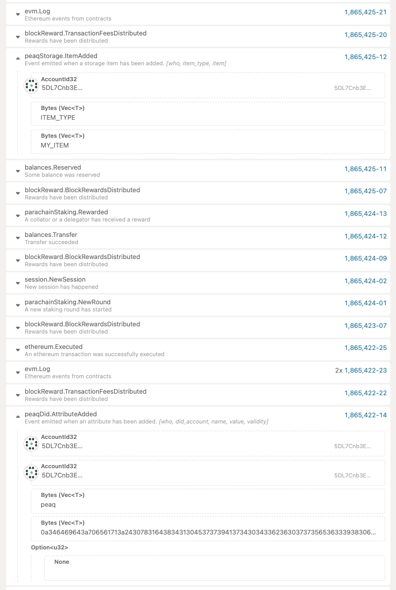

# README

## Overview
This repository implements a gas station-based smart contract system to manage decentralized identity (DID) and data storage operations on the blockchain. It includes four main components:
1. **GasStationFactory Smart Contract:** Manages the creation and operation of machine smart accounts and ensures security by verifying owner & eoa signatures.
2. **MachineSmartAccount Contract:** Represents individual smart accounts with enhanced functionality for managing DID and storage operations. Funded by the gas station.
3. **SDK (sdk.py):** A Python-based software development kit that provides high-level methods to interact with the smart contracts and APIs.
4. **Main Script (main.py):** Demonstrates the flow of using the SDK to interact with the contracts and APIs.

## Workflow Summary
1. **Gas Station Deployment:**
    * A gas station smart contract is deployed using the owner's wallet.
    * The owner generates a signature to authorize the creation of a new MachineSmartAccount.
2. **MachineSmartAccount Creation:**
    * A MachineSmartAccount is created after verifying the owner's signature.
    * The smart account is tied to an externally owned account (EOA) and funded by the gas station.
3. **DID and Email Signature:**
    * An email signature is generated using the Get-Real backend service.
    * The signature is stored in the DID document hash, which is sent to the blockchain on behalf of the MachineSmartAccount funded by the GasStation.
4. **Transaction Validation and Execution:**
    * Before sending a transaction, the calldata is signed by both the EOA and the owner to validate the operation.
    * The signed transaction is executed through the smart contract, ensuring security and correctness.

## Components
### 1. GasStationFactory Smart Contract
The GasStationFactory contract facilitates the deployment of MachineSmartAccount instances and manages various operations, including:
* Deploying new machine accounts.
* Transferring balances securely to machine smart accounts to fund transactions.
* Replay protection through nonce management.
### 2. MachineSmartAccount Contract
The MachineSmartAccount contract represents individual machine accounts that handle:
* Validation of machine owner signature.
* Execution of transactions on target contracts.
* Replay protection through nonce management.
### 3. SDK (`sdk.py`)
The SDK provides a Python interface for interacting with the smart contracts and associated services. It includes methods for:
* Generating and verifying signatures.
* Deploying machine accounts.
* Creating and storing DID documents.
* Interacting with the peaq service backend for email and storage services.
* Executing transactions securely.
### 4. Main Script (`main.py`)
The main script demonstrates the SDK's usage, showcasing:
* Initialization of the SDK with required credentials and configurations.
* Deployment of a MachineSmartAccount.
* DID creation and storage operations.
* Execution of funded transactions.

## Deployment and Usage
### Prerequisites
* Python 3.8+
* Solidity compiler
* Dependencies: web3, requests, dotenv
### Steps
#### 1. **Deploy Smart Contracts:**
* Deploy the `GasStationFactory.sol` contract to the agung/peaq network.
    * owner: approves the transaction
    * gasStation: dedicated address for paying feeds
    * Owner and gasStation can have same address. It was differentiated to give the project options if they want separate accounts.

    Mark down the GasStation deployed address and send to peaq team for token distribution.

#### 2. **Setup Environment Variables:**
* Configure .env with the required API keys, RPC URLs, and private keys. 
* Make sure to align depending on what network you are using.

EXAMPLE ENV:
```
AGUNG_RPC_URL=<Your RPC URL> # URL to connect to the blockchain network for smart contract interactions
PEAQ_SERVICE_URL=<Peaq API Base URL> # Base URL for the Galxe backend service, used for operations like email signature generation
SERVICE_API_KEY=<Service API Key> # Authenticates access to the Peaq service
PROJECT_API_KEY=<Project API Key>
GAS_STATION_ADDRESS=<Gas Station Contract Address> # Address of the deployed GasStationFactory smart contract used for managing machine accounts
GAS_STATION_OWNER_PUBLIC_KEY=<Gas Station Owner Public Key>
GAS_STATION_OWNER_PRIVATE_KEY=<Gas Station Owner Private Key>
EOA_PUBLIC_KEY=<Externally Owned Account Public Key> # Represents the EOA tied to the MachineSmartAccount
EOA_PRIVATE_KEY=<Externally Owned Account Private Key>
```

#### 3. **Run the Main Script:**
* Execute `python main.py` in the python repository to interact with the contracts and APIs.

#### 4. **Verify Results:**

For now you can verify to see if the addAttribute and ItemAdd extrinsics were executed on the block explorer. 
- [peaq explorer](https://polkadot.js.org/apps/?rpc=wss://peaq.api.onfinality.io/public-ws#/explorer)
- [agung explorer](https://polkadot.js.org/apps/?rpc=wss://wss-async.agung.peaq.network#/explorer)

    


    TODO: Verify operations not working as expected on our service endpoints:
    - `v1/verify/did`
    - `v1/data/verify-count`
    - `v1/data/verify`

    Will need to meet with Iredia to discuss.

    You also have the option to test on the frontend using the following [endpoint](https://app.galxe.com/quest/peaq/GCpEitg8Ms). This seems to be a bit more consistent. Please try verifying on this service after running the script. 